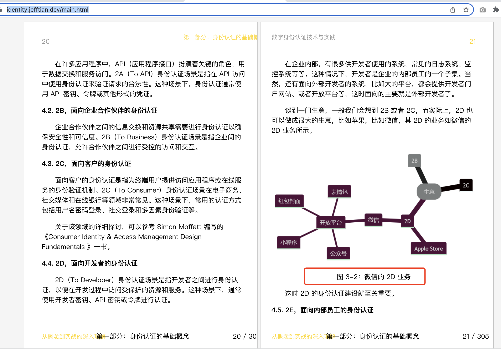
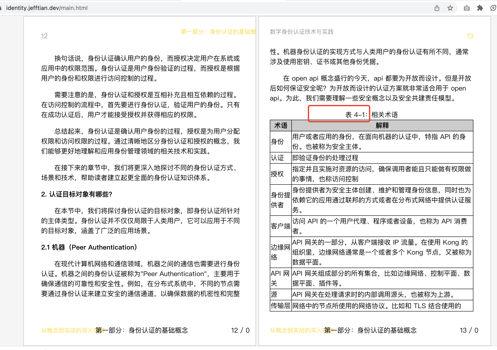

# markdown-it-book-plugin

---------------

> A markdown-it plugin for book or thesis writers.

## Features

- [x] Auto numbered images 
- [x] Auto numbered tables 
- [ ] Auto numbered images made by mermaid source code

## Installation

```shell
yarn add markdown-it-book-plugin
```

## Usage

### Basic:

```js
const MarkdownIt = require("markdown-it");
const md = new MarkdownIt();

md.use(require('markdown-it-book-plugin'));
```

### Advanced with options

```js
const MarkdownIt = require("markdown-it");
const md = new MarkdownIt();

md.use(require('markdown-it-book-plugin'), {
    mainCounterTag: 'h3'
});
```

More examples see

- [test cases](https://github.com/Jeff-Tian/markdown-it-book-plugin/blob/main/test/markdown-it-book.test.js)
- [live example](https://github.com/Jeff-Tian/AllAboutIdentity/blob/main/docs/.vitepress/config.ts#L24)

## Who is using?

- https://identity.jefftian.dev/main.html
- Add yours here by submitting a PR

## Contributing

- Fork it!
- Create your feature branch: `git checkout -b my-new-feature`
- Commit your changes: `git commit -am 'feat: add some feature'`
- Push to the branch: `git push origin my-new-feature`
- Submit a pull request :D

## 💵 Questions

Feel free to [contact me](https://www.zhihu.com/consult/people/1073548674713423872), I'd love to help.

<a href="https://www.zhihu.com/consult/people/1073548674713423872" target="blank"></a>
